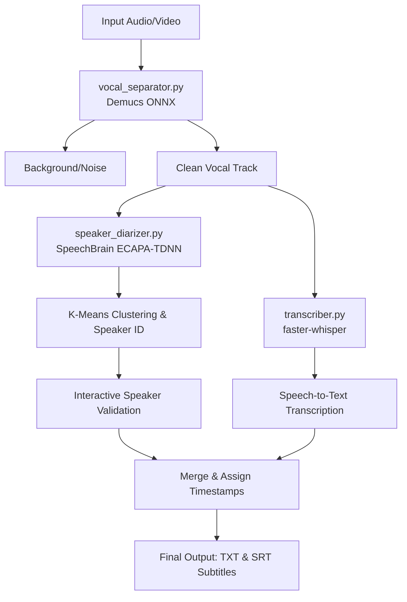
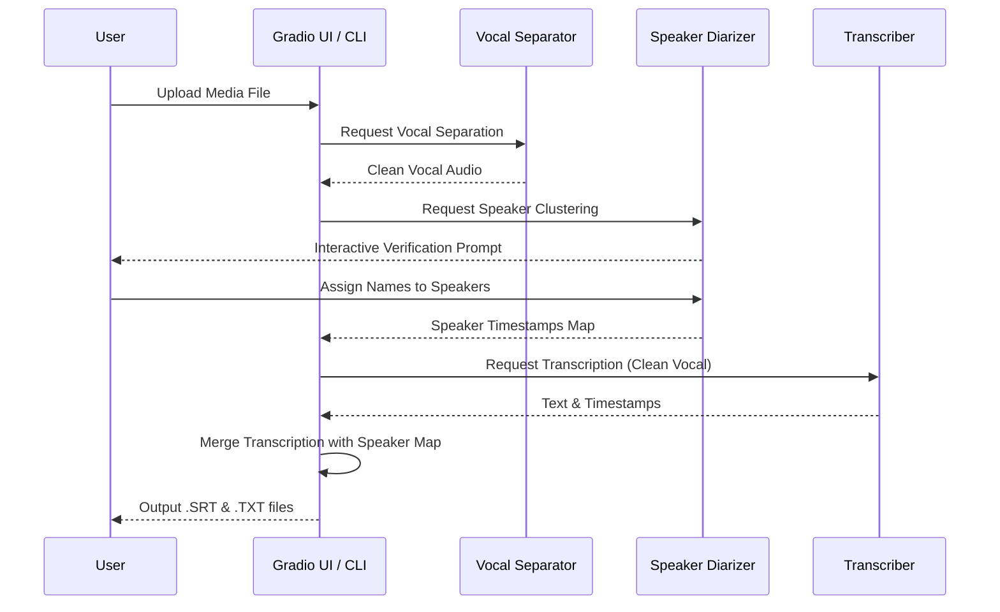

# DiaScript

   

DiaScript는 대용량 동영상 및 음성 파일에서 배경음악(BGM)과 잡음을 제거하고, 인공지능 기반으로 화자를 분리하여 이름을 매핑한 뒤, 최종 전사 스크립트 및 자막 파일(SRT)을 자동 생성하는 고성능 파이썬 프로그램입니다.

본 프로그램은 AMD Ryzen 9 9900X CPU 및 NVIDIA GeForce RTX 5080 GPU 환경에 맞추어 ONNX Runtime GPU 가속 및 faster-whisper CUDA 처리를 극대화하여 수시간 분량의 오디오 트랙도 빠르고 안정적으로 소화할 수 있도록 아키텍처가 설계되었습니다.

---

## 핵심 파이프라인 기능

1. 보컬 분리 모듈 (Demucs ONNX 연동)
- 사용자가 보유하고 있는 demucs4_htdemucs_ft_cac_voice.onnx 가중치 모델을 로드하여 배경음과 보컬 트랙을 정교하게 분리합니다.
- 초대형 오디오 처리 시 발생할 수 있는 Out-Of-Memory(OOM) 오류를 완전히 차단하기 위해 오디오를 7.8초(344,064 샘플) 단위의 청크로 분할하여 슬라이딩 윈도우 방식으로 순차 추론합니다.
- Hanning Window 함수와 75% 오버랩 및 Overlap-Add 병합 기법을 적용하여 청크 경계면의 이음새 잡음(Artifacts)을 원천 배제합니다.

2. 화자 다이어리화 및 대화형 검증 모듈
- 분리 정제된 16kHz 모노 Vocal 트랙을 분석하여 에너지가 존재하는 실 발화 구간(Speech Segment)을 식별합니다.
- 발화 구간마다 고유 화자의 음성 특징(임베딩)을 다차원 벡터로 추출합니다. SpeechBrain ECAPA-TDNN 모델을 기본(Primary)으로 활용하며, 네트워크 미연결 및 오프라인 환경에 완벽히 대비할 수 있도록 librosa/scipy 기반의 MFCC 통계 피처 추출 폴백(Fallback) 모듈이 내장되어 있습니다.
- 실루엣 스코어 기반으로 최적의 화자 수(K)를 1차 자동 감지한 뒤 K-Means 군집화를 거칩니다.
- 터미널 기반의 대화형 검증 루프(Interactive Loop)를 통해 화자별로 가장 조밀하고 뚜렷한 3~5초의 대표 샘플 구간의 타임스탬프를 제시하고, 사용자가 직접 화자 수 보정 및 한글 이름을 매핑할 수 있게 대기합니다.

3. Whisper 음성 전사 및 자막 생성
- CTranslate2 기반으로 최적화된 faster-whisper 엔진을 탑재하여 보컬이 제거된 오디오를 텍스트로 고속 변환합니다.
- 전사 언어는 기본적으로 한국어(ko)로 고정하여 번역 오인식을 막아주며, 영어/다국어 혼용이 필요한 경우 자동 감지(auto) 모드로 유연하게 전환할 수 있습니다.
- 전사된 텍스트 구간의 타임스탬프와 2단계에서 정교하게 보정된 화자 이름 타임라인의 오버랩 영역을 비교하여 실제 화자 이름을 자막에 주입합니다.
- 텍스트 스크립트(.txt)와 자막 규격을 만족하는 표준 SRT 파일(.srt)로 최종 분할 출력합니다.

---

## Technical Architecture & Workflow

### Architecture Diagram

### Sequence Diagram

---

## 프로젝트 디렉토리 구조

diascript.py를 메인으로 하여 각 컴포넌트가 결합된 객체 지향적 구조로 설계되었습니다.

- app.py: Gradio 라이브러리를 활용해 웹 브라우저 상에서 마우스 클릭 및 화자별 개별 플레이어 청음이 가능한 미려한 GUI를 제공하는 메인 웹 앱 파일입니다.
- diascript.py: 전체 3단계 파이프라인의 조율, CLI 인자 처리, 한글 로깅 및 안전한 중간 리소스 정리 기능을 수행하는 통합 메인 스크립트입니다.
- vocal_separator.py: PyAV 기반 다차원 오디오 스트림 추출, Demucs ONNX 로드, 슬라이딩 윈도우 추론 및 Hanning 윈도우 오버랩-애드를 처리하는 보컬 분리 모듈입니다.
- speaker_diarizer.py: 16kHz 리샘플링, 발화 구간 검출, SpeechBrain/MFCC 이중 임베딩 추출, K-Means 클러스터링 및 터미널 검증 인터페이스를 제공하는 화자 분리 모듈입니다.
- transcriber.py: faster-whisper 연동, 전사 텍스트-화자 시간차 겹침 최적화 할당 및 TXT/SRT 다중 포맷 출력을 담당하는 모듈입니다.
- requirements.txt: 라이브러리 및 패키지 의존성 명세 파일입니다.
- README.md: 본 가이드 문서입니다.

---

## 설치 가이드

NVIDIA GPU 가속(CUDA 12.x 이상)을 활용하기 위한 패키지 환경을 권장합니다.

pip install -r requirements.txt

가상환경 및 파이썬 3.10 이상 개발 런타임에서 아래 라이브러리 목록이 설치됩니다:
- onnxruntime-gpu (또는 CPU 환경용 onnxruntime)
- faster-whisper
- numpy
- soundfile
- librosa
- scikit-learn
- speechbrain
- av

## 필수 대용량 가중치 모델 파일 수동 배치 안내
- 본 프로젝트는 대용량 모델 파일로 인한 저장소 용량 초과 및 전송 속도 저하를 막기 위해 아래의 대형 인공지능 모델 가중치 파일들을 .gitignore 목록에 추가하여 Git 추적에서 정식 제외하였습니다.
- 프로그램 구동 전에 아래 가중치 파일들을 프로젝트 루트 디렉토리에 수동으로 배치해야 정상 추론이 가능합니다:
  1. demucs4_htdemucs_cac.onnx 및 하위 보컬 분리 ft 시리즈 ONNX 파일들
  2. models 폴더 및 하위 음향 정제용 PTH/ONNX 파일들

---

## 실행 방법

diascript.py CLI 프로그램을 아래 옵션을 조합하여 구동합니다.

기본 실행 (GPU 가속, 한국어 고정, base 모델 사용):
python diascript.py --input "경로/파일명.mp4"

모든 CLI 옵션 상세 안내:

- --input, -i (필수)
  입력 동영상 또는 오디오 파일 경로 (예: WAV, MP3, MP4, MKV)
- --model, -m
  Demucs ONNX 모델 가중치 경로 (기본값: demucs4_htdemucs_ft_cac_voice.onnx)
- --whisper-model, -w
  faster-whisper 크기 선택 (기본값: base / tiny, small, medium, large-v3 등 사용 가능)
- --language, -l
  전사 언어 모드 (ko: 한국어 강제 고정, auto: 자동 감지 및 혼용 전사)
- --output-dir, -o
  최종 결과물 저장 디렉토리 (기본값: 입력 파일과 동일 디렉토리)
- --no-gpu
  GPU 가속 장치 대신 CPU로 연산을 강제 고정하는 옵션

자동 감지 및 대형 모델을 적용한 예시:
python diascript.py --input "samples/interview.mkv" --whisper-model small --language auto

---

## Gradio 웹 UI 실행 방법

터미널 CLI 조작 대신, 웹 브라우저 상에서 미려한 그래픽 인터페이스와 편리한 개별 화자 청음 감별 기능을 사용하려면 app.py 웹 서버를 구동합니다.

웹 UI 실행 명령어:
python app.py

명령어 실행 시 Gradio 웹 서버가 즉시 가동되며, 로컬호스트 주소(http://127.0.0.1:7860)를 통해 브라우저에서 편리하게 보컬 분리, 청음 기반 화자 보정, 최종 자막 파일 다운로드까지 마우스 클릭으로 순차 제어하실 수 있습니다.

---

## 상세 에러 및 상황 대처

1. GPU / CUDA 지원 오류 발생 시
- 시스템에 CUDA 런타임이 세팅되지 않은 경우, ONNX Runtime 및 faster-whisper 구동 중에 CUDA 오류가 유발될 수 있습니다.
- 이 경우 실행 명령어 끝에 --no-gpu 인자를 추가해 주시면 CPU 런타임 및 INT8 수치 정밀도로 강제 보정되어 안전하게 실행됩니다.

2. 오프라인 실행 및 인터넷 미연결 시 (SpeechBrain 다운로드 스킵)
- SpeechBrain 화자 인식 가중치 파일은 최초 1회 다운로드를 위해 인터넷이 필요합니다.
- 만약 군망이나 격리된 오프라인 환경 등 네트워크 단절 상태인 경우, 본 프로그램은 예외 상황을 감지하고 내장된 MFCC 특징 주성분 분석 Fallback 알고리즘으로 100% 자동 선회하여 화자를 분리하므로 중단 없이 처리를 지속할 수 있습니다.

3. 윈도우 환경 Gradio 파일 캐시 권한 거부 오류 (Errno 13) 및 디버깅 강화
- 윈도우 운영체제의 파일 시스템과 Gradio 프레임워크 고유의 임시 파일 캐싱/이송기 간의 충돌로 인해 간헐적인 Permission denied 에러가 발생할 수 있습니다.
- 본 프로그램은 이러한 윈도우 런타임 캐시 오류를 완벽히 모니터링하고 박멸하기 위해 백엔드 로직에 디버깅 강화 추적 시스템을 탑재하였습니다.
- 연산 중 예외가 발생할 경우, 브라우저 화면의 에러 토스트 팝업창에 예외가 발생한 정확한 파이썬 소스코드 라인 넘버와 백트레이스 정보가 상세하게 노출되도록 강인화되었습니다.
- 향후 디버깅 로깅 시스템의 고도화를 지속할 예정이며, 파일 캐싱 충돌이 지속될 경우 8쌍의 오디오 컴포넌트 구조를 단 하나의 gr.HTML 컴포넌트와 전용 파일 스트리밍 라우터 서빙 아키텍처로 통째로 마이그레이션하여 캐싱 시스템의 권한 잠금 오류를 물리적으로 원천 종식시키는 패치를 순차 적용할 계획입니다.
